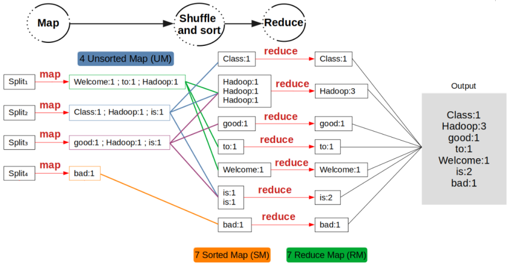
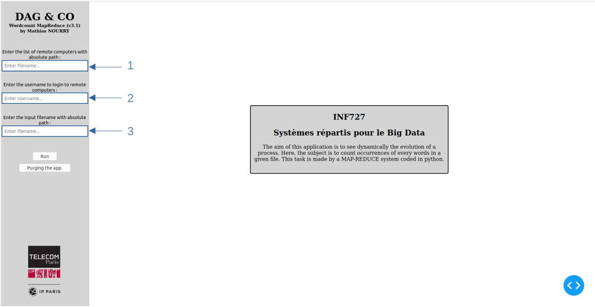
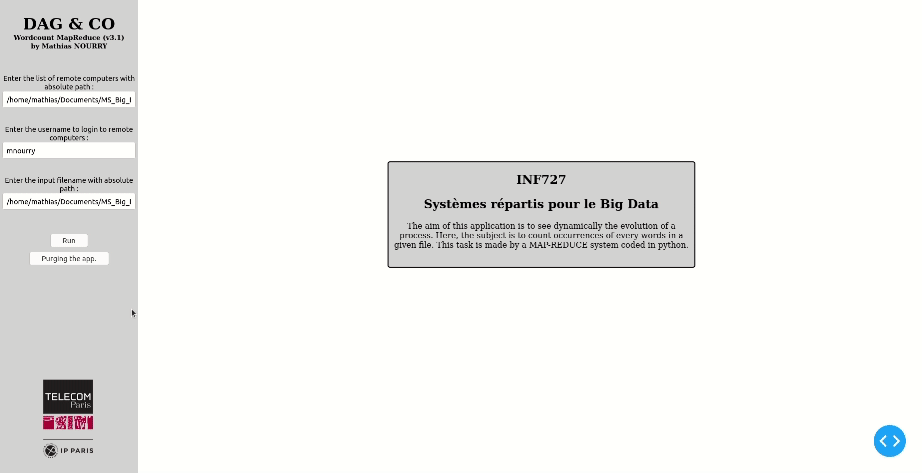

<h1 align="center">
  MapReduce from scratch !
</h1>

DAGandCo is a pseudo DAG (Directed Acyclic Graph) builder application to visualize in real time the execution of a MapReduce system for distributed calculations. Its development is part of the INF 727 course given at Télecom Paris dealing with distributed systems.

## Quick introduction to MapReduce system 

Because a diagram is sometimes worth more than a thousand words, here is the functioning of a MapReduce system applied to the counting of words in the following text:

<h6 align="center">Welcome to Hadoop Class</h6>
<h6 align="center">Hadoop is good</h6>
<h6 align="center">Hadoop is bad</h6>

  

## Environment and operation

First of all, it is important to know that the MapReduce system uses the ***split*** unix command here. It is therefore necessary to have a unix system (Linux or Mac).   
What's more, DAGandCo requires the installation of ***dash*** and ***dash_cytoscape*** packages from [PyPI](https://pypi.org)

<pre>
$ pip install dash
$ pip install dash_cytoscape
</pre>

Other packages are used but are directly empacked if you have downloaded Python via Anaconda.   
Finally, the list of packages used in the application and whose versions may cause problems are as follows:

<pre>
dash.__version__ == 1.17.0
dash_cytoscape.__version__ == 0.2.0
pandas.__version__ == 1.1.4
</pre>

At first operation it is necessary to make some python scripts executable. To do this, go to the directory where the scripts ***MASTER_v3_1.py*** and ***SLAVE_v3_1.py*** are located and execute the following unix command in your terminal : 

<pre>
$ chmod +x MASTER_v3_1.py SLAVE_v3_1.py
</pre>

To ensure the proper functioning of the application it is also necessary to have established RSA key authentication with the different machines of the selected cluster in order to bypass the need of passwords.   
To do this you need to execute the following unix command in your terminal :

<pre>
$ ssh-keygen -t rsa
$ ssh-copy-id your_username@computer_name
</pre>

## Getting started

DAGandCo needs 3 inputs to launch a wordcount MapReduce process:
1. the list of computers that make up the cluster;
2. the username used for identification at each computer of the cluster;
3. the path of the file on which to apply the wordcount.

  

Once the entries have been filled in from the DAGandCo interface, you can launch the job.   
You should see the DAG being built in real time as the MapReduce process is running.   

  

## Notation 

The developed system does not allow to manage cluster computer failures. A color-coding is therefore used in the DAGandCo interface to inform the user of the various cluster events:
- Green node = the computer has performed its task correctly
- Blue node = occurs during a SHUFFLE if a computer didn't receive files to REDUCE
- Orange node = this colour may appear if, during SHUFFLE, at least one SSH command to transfer a file between two computers in the cluster has failed. It thus reflects a loss of information
- Red node = reports a fatal error on the computer, the task could not be performed

## Limitation and areas for improvment

- A 10-seconds timeout is taken into account during the first ssh connection with each computer in the cluster. Actually, if this time is exceeded for at least one computer of the cluster, the whole process is stopped : this exception is considered as a fatal error. For the future, after detecting this exception, it would be better to ignore only the computer affected by the exception for the rest of the process and thus let the rest of the process run on the rest of the cluster.

- From to the color-coding used by the DAGandCo UI, we can see the data resiliency is not ensured by the process. Indeed, if a computer crashes during the process, the final result is not assured. For the future, it would be preferable to consider a replication factor to ensure that the data is always available in the cluster despite a failure of part of it.
